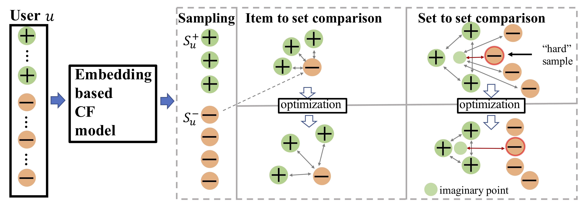

# Set2setRank SIGIR2021

### **Set2setRank: Collaborative Set to Set Ranking for Implicit Feedback based Recommendation**



As users often express their preferences with binary behavior data~(implicit feedback), such as clicking items or buying products, implicit feedback based Collaborative Filtering~(CF) models predict the top ranked items a user might like by leveraging implicit user-item interaction data. For each user, the implicit feedback is divided into two sets: an observed item set with limited observed behaviors, and a large unobserved item set that is mixed with negative item behaviors and unknown behaviors. Given any user preference prediction model, researchers either designed ranking based optimization goals or relied on negative item mining techniques for better optimization. Despite the performance gain of these implicit feedback based models, the recommendation results are still far from satisfactory due to the sparsity of the observed item set for each user. To this end, in this paper, we explore the unique characteristics of the implicit feedback and propose Set2setRank framework for recommendation. The optimization criteria of Set2setRank are two folds: First, we design an item to an item set comparison that encourages each observed item from the sampled observed set is ranked higher than any unobserved item from the sampled unobserved set. Second, we model set level comparison that encourages a margin between the distance summarized from the observed item set and the most ``hard'' unobserved item from the sampled negative set. Further, an adaptive sampling technique is designed to implement these two goals. We have to note that our proposed framework is model-agnostic and can be easily applied to most recommendation prediction approaches, and is time efficient in practice. Finally, extensive experiments on three real-world datasets demonstrate the superiority of our proposed approach. 

We provide PyTorch and Mindspore implementations for Set2setRank model.

## Pytorch implementation

### Prerequisites

- PyTorch
- Python 3.5
- CPU or NVIDIA GPU + CUDA CuDNN

### Getting Started

#### Installation

- Clone this repo:

```bash
git clone https://github.com/newlei/Set2setRank.git
cd Set2setRank
cd code_pytorch
```

#### Datasets

We provide MovieLens_20M dataset. Due to the max file size to 100 MB, some data (traing_set.npy) is missing. You can generate traing_set.npy by:
```bash
cd MovieLens_20M
python generate_training_npy.py
```

#### Code
Now, we provide code of Set2setRank_BPR and Set2setRank(A)_BPR.
Please open "code_pytorch/Set2setRank_BPR.py" and "code_pytorch/Set2setRank(A)_BPR.py"
- In each code, there are two types of dataloader, please choose one.
- The code for calculating HR and NDCG is separate, please refer to "code_pytorch/s_test.py"

Set2setRank_GCN and Set2setRank(A)_GCN will coming.


## Mindspore implementation

### Prerequisites

- Mindspore
- Python 3.8
- NVIDIA GPU + CUDA CuDNN

#### Installation

- Mindspore Installation

    [Official website](https://www.mindspore.cn/install/)

    [My personal experience](https://mp.weixin.qq.com/s/y8QBHicNBy6F0JoCpJQI2Q)

- Clone this repo:

```bash
git clone https://github.com/newlei/Set2setRank.git
cd Set2setRank
cd code_mindspore
```
#### Datasets
Using the same data as pytorch implementation

#### Code
Now, we provide code of Set2setRank_BPR.
Please open "code_mindspore/Set2setRank_BPR.py".


## Citation
If you find this useful for your research, please kindly cite the following paper.
```
@article{chen2021set,
  title={Set2setRank: Collaborative Set to Set Ranking for Implicit Feedback based Recommendation},
  author={Lei, Chen and Le, Wu and Kun, Zhang and  Richang, Hong and Meng, Wang}
  journal={SIGIR},
  year={2021}
}
```

Besides, you may find these following works are useful for understanding GCN-based recommendation.
```
@article{chen2019revis,
  title={Revisiting Graph based Collaborative Filtering: A Linear Residual Graph Convolutional Network Approach},
  author={Lei, Chen and Le, Wu and  Richang, Hong and Kun, Zhang and Meng, Wang}
  journal={AAAI},
  year={2019}
}
```

## Acknowledgments
We thank LMC lab. of Hefei University of Technology

## Other Information
Self-supervised learning recommendation


From the perspective of set, self-supervised information of implicit feedback is mined
 

